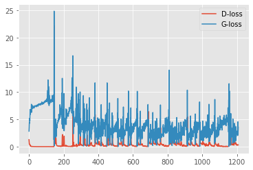
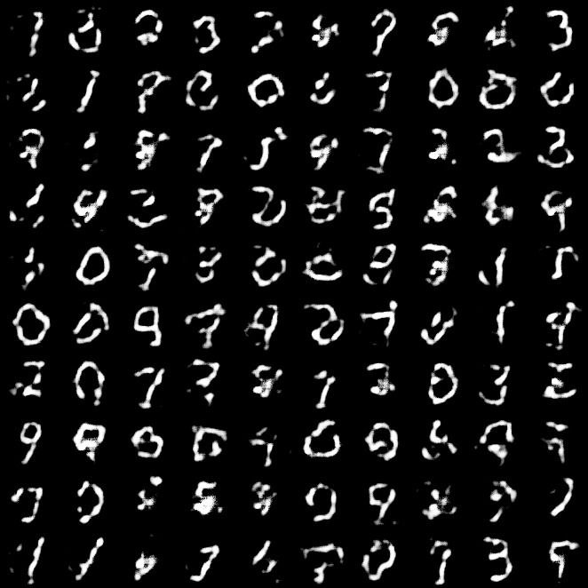

# GAN using MNIST dataset
- ### accuracy graph
  
- ### GAN output
  
- ### Common problems faced by GAN
  - #### Model Collapse
      During the development of this particular GAN model, I faced the issue of mode collapse. This occurs when your generator generates only one or a           samll set of your actual output which in reality consist of various more outputs. This usually occurs when the generator can generate any particular       output  that can easily fool the Discriminator. Therefore, the Generator keeps on generting that same output and thinks that it has won the rat race       with the       discriminator.
